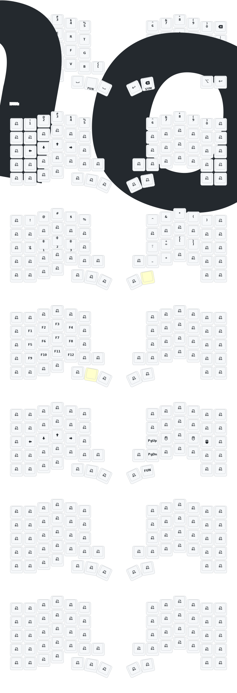

# Keyball61 ZMK firmware

Este repositorio configura y compila firmware ZMK para un teclado Keyball61
Bluetooth. La configuracion vive en este repositorio; la compilacion se delega
a GitHub Actions.

## Flujo de build

1. Editar los archivos de configuracion ZMK bajo `config/`.
2. Pushear el cambio a GitHub.
3. GitHub Actions ejecuta el workflow de build de ZMK.
4. El workflow genera artefactos UF2 para flashear el teclado.

En este repositorio no se compila localmente.

```yaml
# build.yaml
include:
  - board: nice_nano_v2
    shield: keyball61_left
  - board: nice_nano_v2
    shield: keyball61_right
    snippet: studio-rpc-usb-uart
  - board: nice_nano_v2
    shield: settings_reset
```

`build.yaml` le dice al workflow de ZMK que variantes de firmware debe
construir:

- `nice_nano_v2`: placa controladora.
- `keyball61_left`: firmware de la mitad izquierda.
- `keyball61_right`: firmware de la mitad derecha.
- `studio-rpc-usb-uart`: habilita ZMK Studio RPC por USB UART en la mitad
  derecha.
- `settings_reset`: firmware para limpiar configuraciones guardadas.

El workflow que consume esa configuracion es:

```yaml
# .github/workflows/build.yml
jobs:
  build:
    uses: zmkfirmware/zmk/.github/workflows/build-user-config.yml@v0.3
```

## Archivos de configuracion

| Archivo | Que configura |
| --- | --- |
| `config/keyball61.keymap` | Comportamiento del teclado: layers, teclas, combos, macros y tiempos hold-tap. |
| `config/keyball61.conf` | Opciones globales de ZMK y Bluetooth. |
| `config/boards/shields/keyball61/keyball61_right.conf` | Opciones de la mitad derecha, incluido el trackball PMW3610. |
| `config/boards/shields/keyball61/keyball61.dtsi` | Layout fisico compartido, transformacion de matriz y scanner. |
| `config/boards/shields/keyball61/keyball61_left.overlay` | Matriz GPIO y OLED de la mitad izquierda. |
| `config/boards/shields/keyball61/keyball61_right.overlay` | Matriz GPIO, OLED, bus SPI y cableado del trackball de la mitad derecha. |
| `config/west.yml` | Revisiones de ZMK y del driver externo PMW3610. |
| `keymap_drawer.config.yaml` | Reglas para dibujar el SVG del keymap. No cambia el firmware. |

## Keymap y comportamiento

`config/keyball61.keymap` es el archivo principal de comportamiento. Primero
asigna numeros a los layers:

```c
#define DEFAULT 0
#define NUM     1
#define SYM     2
#define FUN     3
#define MOUSE   4
#define SCROLL  5
#define SNIPE   6
#define LOCK    7
```

Estos nombres se usan despues en comportamientos de layers:

- `&mo LAYER`: activa un layer solo mientras se mantiene presionada la tecla.
- `&tog LAYER`: alterna un layer entre activo e inactivo.
- `&to LAYER`: cambia directamente a un layer.
- `&trans`: deja pasar la tecla al layer activo inferior.
- `&none`: deshabilita esa posicion en ese layer.

### Tiempos hold-tap

Los comportamientos hold-tap globales se ajustan al inicio del keymap:

```c
&lt {
    tapping-term-ms = <240>;
    flavor = "balanced";
    quick-tap-ms = <150>;
};

&mt {
    tapping-term-ms = <200>;
    flavor = "tap-preferred";
    quick-tap-ms = <150>;
};
```

Variables importantes:

- `tapping-term-ms`: ventana de tiempo, en milisegundos, para decidir si una
  tecla hold-tap fue tap o hold.
- `flavor`: criterio de resolucion cuando se presiona otra tecla dentro de la
  ventana de tap.
- `quick-tap-ms`: si se vuelve a tocar la misma tecla dentro de esta ventana,
  ZMK favorece el tap.
- `&lt`: layer-tap; tap envia una tecla y hold activa un layer.
- `&mt`: mod-tap; tap envia una tecla y hold envia un modificador.

El repo tambien define comportamientos propios para mouse y scroll:

```c
mouse_hold_toggle: mouse_hold_toggle {
    compatible = "zmk,behavior-hold-tap";
    #binding-cells = <2>;
    tapping-term-ms = <500>;
    flavor = "balanced";
    bindings = <&mo>, <&tog>;
};

scroll_hold_toggle: scroll_hold_toggle {
    compatible = "zmk,behavior-hold-tap";
    #binding-cells = <2>;
    tapping-term-ms = <200>;
    flavor = "hold-preferred";
    bindings = <&mo>, <&td_scroll_toggle>;
};
```

`mouse_hold_toggle MOUSE MOUSE` significa:

- hold: activa `MOUSE` mientras se mantiene presionada la tecla, usando `&mo`.
- tap: alterna `MOUSE`, usando `&tog`.
- `tapping-term-ms = <500>` da una ventana mas larga para decidir tap vs hold.

`scroll_hold_toggle SCROLL 0` significa:

- hold: activa `SCROLL` mientras se mantiene presionada la tecla.
- tap: ejecuta el tap-dance de scroll.
- `flavor = "hold-preferred"` hace que el hold sea mas facil de activar.

El tap-dance usado por scroll es:

```c
td_scroll_toggle: td_scroll_toggle {
    compatible = "zmk,behavior-tap-dance";
    #binding-cells = <0>;
    tapping-term-ms = <350>;
    bindings = <&none>, <&tog SCROLL>;
};
```

Un tap no hace nada. Dos taps dentro de `350 ms` alternan el layer `SCROLL`.

### Combos

Los combos se activan cuando varias posiciones fisicas se presionan dentro de
un tiempo corto:

```c
combo_mouse_lock {
    timeout-ms = <80>;
    key-positions = <54 58>;
    layers = <MOUSE>;
    bindings = <&to LOCK>;
};

combo_unlock {
    timeout-ms = <80>;
    key-positions = <54 58>;
    layers = <LOCK>;
    bindings = <&to DEFAULT>;
};
```

Variables importantes:

- `timeout-ms`: tiempo maximo entre las teclas del combo.
- `key-positions`: indices fisicos de teclas segun la transformacion de matriz.
- `layers`: layers donde el combo esta activo.
- `bindings`: comportamiento que dispara el combo.

En este caso, las posiciones `54` y `58` cambian de `MOUSE` a `LOCK`; las
mismas posiciones cambian de `LOCK` a `DEFAULT`.

### Layers

El nodo `keymap` define la distribucion real:

```c
keymap {
    compatible = "zmk,keymap";

    default_layer {
        label = "QWRT";
        bindings = < ... >;
    };

    mouse_layer {
        label = "MOUSE";
        bindings = < ... >;
    };
};
```

Layers relevantes:

- `DEFAULT` / `QWRT`: layer base de escritura.
- `NUM`: numeros y flechas.
- `SYM`: simbolos y controles Bluetooth.
- `FUN`: teclas de funcion y macro `email_rodrigo`.
- `MOUSE`: botones de mouse, navegacion, multimedia y acceso a scroll.
- `SCROLL`: layer usado por el driver PMW3610 para modo scroll.
- `SNIPE`: modo de precision con CPI bajo.
- `LOCK`: layer deshabilitado usado para bloquear comportamiento hasta
  desbloquearlo.

## Configuracion del trackball

El trackball se configura en dos lugares:

- `config/boards/shields/keyball61/keyball61_right.overlay`: cableado y nodo de
  hardware.
- `config/boards/shields/keyball61/keyball61_right.conf`: comportamiento del
  sensor PMW3610.

### Nodo de hardware

```c
trackball: trackball@0 {
    status = "okay";
    compatible = "zmk,pmw3610";
    reg = <0>;
    spi-max-frequency = <2000000>;
    irq-gpios = <&gpio1 11 (GPIO_ACTIVE_LOW | GPIO_PULL_UP)>;
    scroll-layers = <5>;
    snipe-layers = <6>;

    trackball_lock {
        layers = <0 2 3 7>;
        bindings = <&none>, <&none>, <&none>, <&none>;
        tick = <1>;
    };
};
```

Variables importantes:

- `compatible = "zmk,pmw3610"`: selecciona el driver del sensor optico PMW3610.
- `spi-max-frequency = <2000000>`: fija la velocidad SPI en 2 MHz.
- `irq-gpios`: pin de interrupcion usado por el sensor.
- `scroll-layers = <5>`: asocia el layer `SCROLL` al modo scroll.
- `snipe-layers = <6>`: asocia el layer `SNIPE` al modo de precision.
- `trackball_lock.layers = <0 2 3 7>`: aplica el bloqueo del trackball en
  `DEFAULT`, `SYM`, `FUN` y `LOCK`.
- `trackball_lock.bindings = <&none>, ...`: deshabilita salida del trackball en
  esos layers.
- `tick = <1>`: intervalo interno usado por el bloqueo del driver.

### Opciones de comportamiento

```conf
CONFIG_PMW3610_CPI=1200
CONFIG_PMW3610_SNIPE_CPI=400
CONFIG_PMW3610_SCROLL_TICK=32
CONFIG_PMW3610_AUTOMOUSE_TIMEOUT_MS=700
CONFIG_PMW3610_MOVEMENT_THRESHOLD=0
CONFIG_PMW3610_RUN_DOWNSHIFT_TIME_MS=3264
CONFIG_PMW3610_REST1_SAMPLE_TIME_MS=20
```

Variables importantes:

- `CONFIG_PMW3610_CPI`: sensibilidad normal del puntero.
- `CONFIG_PMW3610_SNIPE_CPI`: sensibilidad reducida para modo `SNIPE`.
- `CONFIG_PMW3610_SCROLL_TICK`: cantidad de movimiento necesaria para emitir un
  paso de scroll.
- `CONFIG_PMW3610_AUTOMOUSE_TIMEOUT_MS`: tiempo durante el cual queda activo el
  comportamiento automatico de mouse despues de mover el trackball. En este repo
  esta en `700 ms`.
- `CONFIG_PMW3610_MOVEMENT_THRESHOLD`: umbral minimo de movimiento. `0` indica
  que no hay umbral adicional.
- `CONFIG_PMW3610_RUN_DOWNSHIFT_TIME_MS`: tiempo antes de que el sensor baje de
  modo activo a un modo de menor consumo.
- `CONFIG_PMW3610_REST1_SAMPLE_TIME_MS`: intervalo de muestreo en el primer modo
  de reposo.
- `CONFIG_PMW3610_ORIENTATION_180=y`: rota la orientacion del puntero 180
  grados.
- `CONFIG_PMW3610_INVERT_SCROLL_X=y`: invierte el scroll horizontal.
- `CONFIG_PMW3610_INVERT_SCROLL_Y=n`: mantiene normal el scroll vertical.

## Bluetooth y opciones globales

Las opciones globales estan en `config/keyball61.conf`:

```conf
CONFIG_BT_PERIPHERAL_PREF_MAX_INT=9
CONFIG_BT_PERIPHERAL_PREF_LATENCY=16
CONFIG_BT_CTLR_TX_PWR_PLUS_8=y
CONFIG_ZMK_BLE_EXPERIMENTAL_CONN=y
CONFIG_ZMK_SPLIT_BLE_CENTRAL_BATTERY_LEVEL_FETCHING=y
CONFIG_ZMK_SPLIT_BLE_CENTRAL_BATTERY_LEVEL_PROXY=y
CONFIG_ZMK_BEHAVIORS_QUEUE_SIZE=512
CONFIG_ZMK_DISPLAY=y
CONFIG_ZMK_EXT_POWER=y
```

Variables importantes:

- `CONFIG_BT_PERIPHERAL_PREF_MAX_INT`: intervalo maximo preferido de conexion
  BLE.
- `CONFIG_BT_PERIPHERAL_PREF_LATENCY`: latencia BLE preferida del periferico.
- `CONFIG_BT_CTLR_TX_PWR_PLUS_8=y`: potencia de transmision Bluetooth en +8
  dBm.
- `CONFIG_ZMK_BLE_EXPERIMENTAL_CONN=y`: habilita manejo experimental de
  conexiones BLE de ZMK.
- `CONFIG_ZMK_SPLIT_BLE_CENTRAL_BATTERY_LEVEL_FETCHING=y`: permite que la mitad
  central consulte la bateria de la periferica.
- `CONFIG_ZMK_SPLIT_BLE_CENTRAL_BATTERY_LEVEL_PROXY=y`: expone la bateria de la
  periferica a traves de la mitad central.
- `CONFIG_ZMK_BEHAVIORS_QUEUE_SIZE=512`: aumenta la cola de comportamientos.
- `CONFIG_ZMK_DISPLAY=y`: habilita soporte de pantalla OLED.
- `CONFIG_ZMK_EXT_POWER=y`: habilita soporte de control de energia externa.

## Matriz y layout fisico

`config/boards/shields/keyball61/keyball61.dtsi` define como las teclas fisicas
se traducen a posiciones del keymap:

```c
default_transform: keymap_transform_0 {
    compatible = "zmk,matrix-transform";
    columns = <13>;
    rows = <5>;

    map = <
        RC(0,0) RC(0,1) ...
    >;
};
```

Variables importantes:

- `rows` y `columns`: tamano logico de la matriz.
- `map`: convierte coordenadas fila/columna al orden usado por
  `config/keyball61.keymap`.
- `keyball_physical_layout.keys`: metadatos del layout fisico usados por ZMK.

Los overlays izquierdo y derecho definen los pines GPIO de cada mitad:

```c
&kscan0 {
    row-gpios = <...>;
    col-gpios = <...>;
};
```

`row-gpios` y `col-gpios` son los pines electricos de la matriz. Cambiarlos
modifica como el firmware escanea los switches fisicos.

## SVG del keymap

`keymap_drawer.config.yaml` controla como se dibuja el SVG generado. No cambia
el comportamiento del firmware. El workflow es:

```yaml
# .github/workflows/keymap_drawer.yml
jobs:
  draw:
    uses: caksoylar/keymap-drawer/.github/workflows/draw-zmk.yml@main
```

El SVG generado queda bajo `keymap-drawer/`.

## Creditos

This keeb created by a group of people who loves keyball.

Special Thanks to: <br>
PCB: *[yangxing844](https://github.com/yangxing844)* <br>
Case: *[delock](https://github.com/delock)* <br>
Firmware: *[Amos698](https://github.com/Amos698)* <br>


